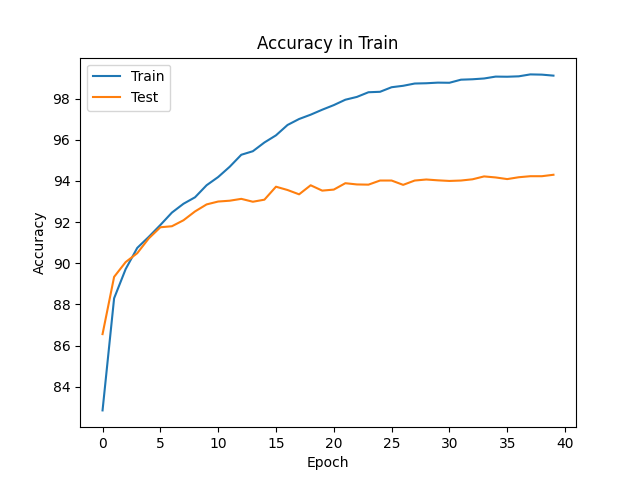
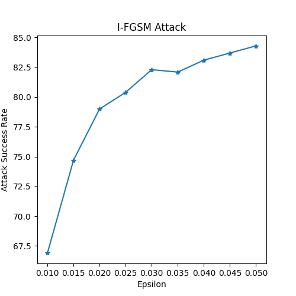
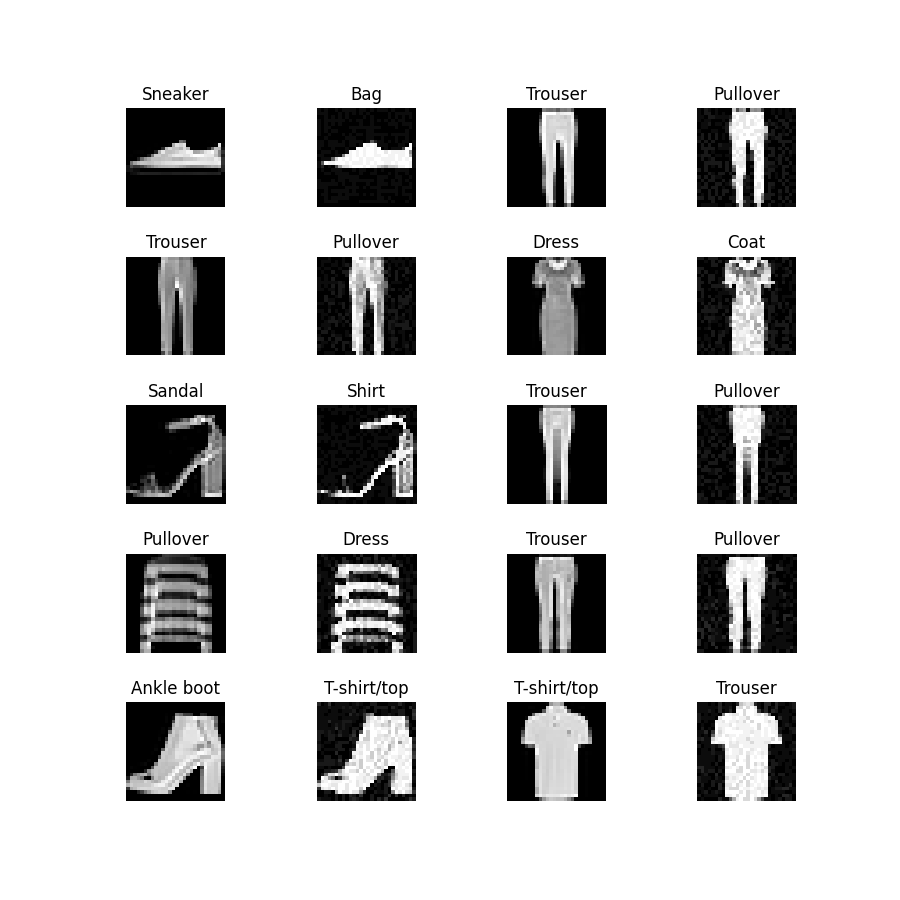
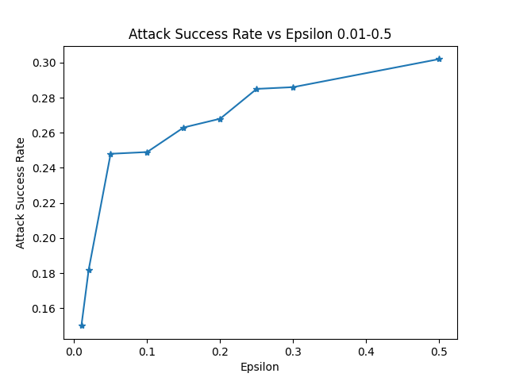
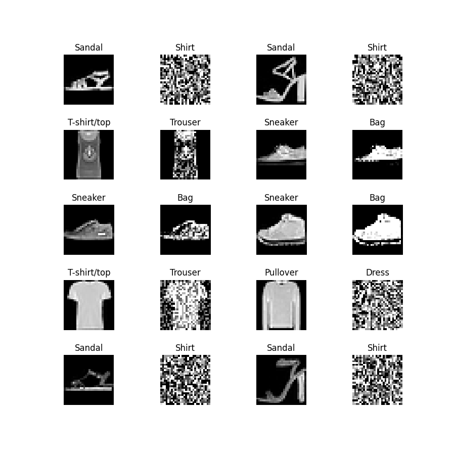
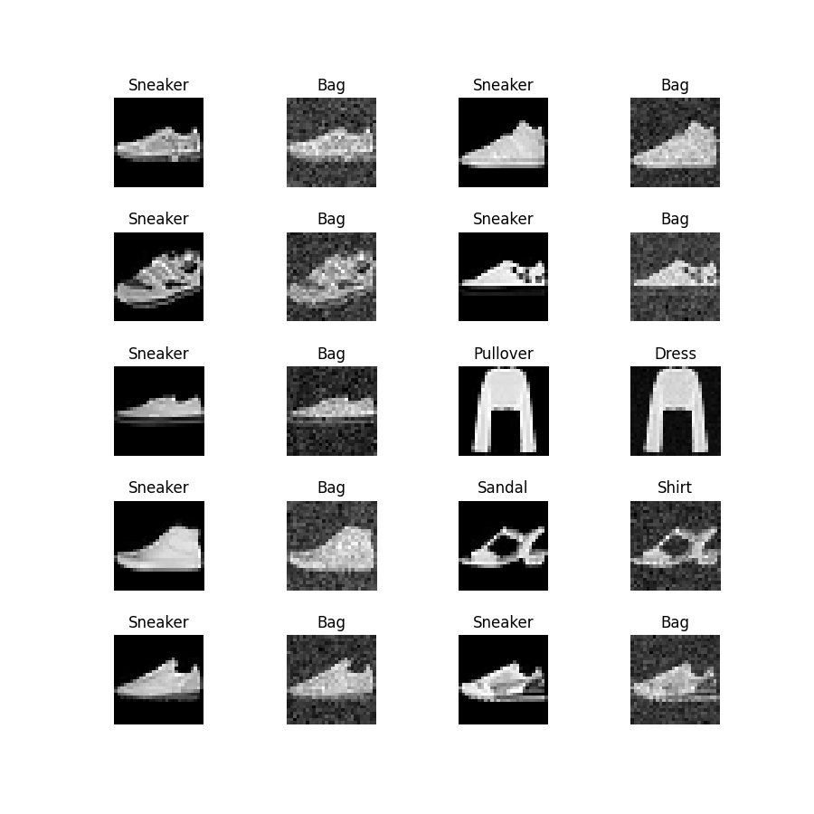
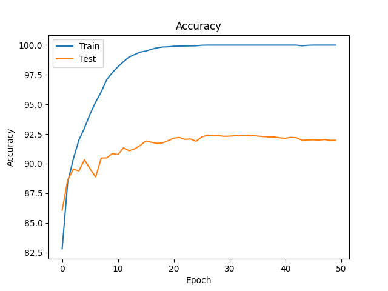

# 平时作业（2）：图像分类模型的对抗攻击和对抗训练
2301210663 佘家瑞

## 前期准备
### 白盒模型
采用 resnet34 模型作为分类器，训练后在测试集上的准确率达到 94.3%，模型文件位于 `./code/res_net.py`，模型数据存储于 `./model/resnet34.ckpt` 中。

另外随机选择了 1000 张正确分类的图片，存储于 `./data/white_correct_1k.pkl` 中。


## 任务一、白盒攻击
### I-FGSM 攻击
对该任务采用了 I-FGSM 算法进行攻击，具体来说：
1. 给定输入图像 x 和目标类别 y ，初始化对抗样本 x_adv = x;
2. 重复以下步骤 max_iter 次：
    a. 计算对抗样本 x_adv 的梯度；\
    b. 将梯度标准化，确保每个像素的扰动大小不超过一定的阈值；\
    c. 根据梯度的方向和标准化的大小（epsilon）来更新对抗样本：\
        ```python
        x_adv = x_adv - epsilon * data_grad.sign()
        ``` \
    d. 将对抗样本的像素值截断到 [0, 1] 之间;
3. 返回最终生成的对抗样本x_adv。

### 提交内容：
1. 分类器在 test 集上的准确率为 94.3%（见 `./results/Task1/classifier_acc.png`），源码为 `./code/res_net.py`

2. 白盒攻击成功率达到 84.3%（见 `./results/Task1/white_box_attack_result.png`）

3. 原图像和对抗样本图像以及分类器的判别类别存储在 `./results/Task1/white_box_attack_result.png`



## 任务二、黑盒攻击
该任务用了两种方法分别攻击给定黑盒模型和自己训练的白盒模型。

### 1. 对给定黑盒模型对攻击——样本迁移
对提供的黑盒模型采用了样本迁移的方法进行攻击，具体来说：
1. 用白盒模型对黑盒模型能够正确分类的样本进行攻击；
2. 直到黑盒模型错误地将样本分类为目标类型，或者达到最大迭代次数。

#### 1.1 结果
样本迁移攻击算法的成功率达到了 30.2%（见 `./results/Task2/black_attack_result.png`）


样本迁移的原始图像与对抗样本图像以及分类器的判别类别存储在 `./results/Task2/black_box_attack_result.png`


样本迁移的源码为 `./code/black_box_attack.py`

### 2. 对自己训练的白盒模型的攻击——MCMC 采样
对自己训练的白盒模型采用了 MCMC 采样的方法进行攻击，具体来说：
1.

#### 2.1 结果
MCMC 采样攻击算法的成功率达到了 7.5%。

MCMC 采样的原始图像与对抗样本图像以及分类器的判别类别存储在 `./results/Task2/mcmc_result.png`


MCMC 采样的源码为 `./code/mcmc.py`

## 任务三、对抗训练
### 提交内容
1. 新分类器在测试集上的准确率为 92.4%（见 ）。作为对比，旧分类器在测试集上的准确率为 94.3%。

2. 

